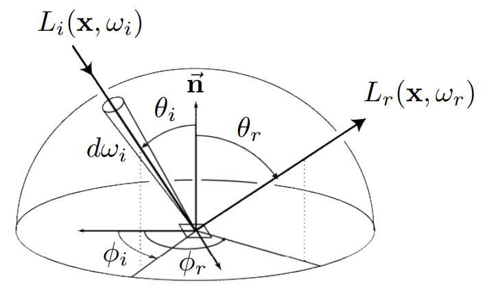
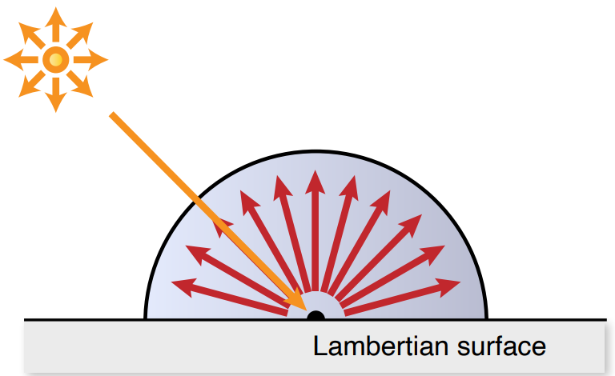
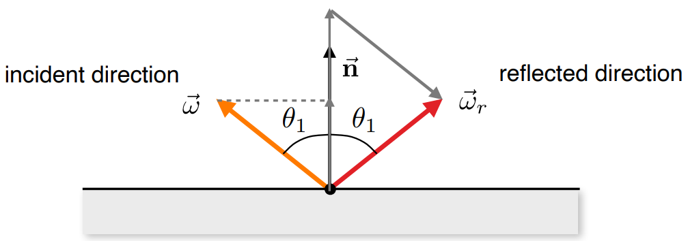
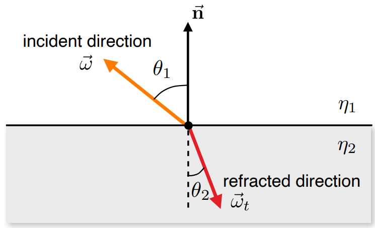
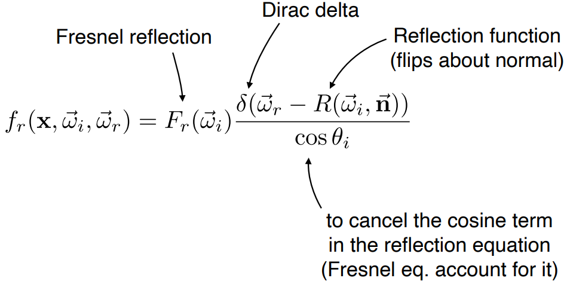
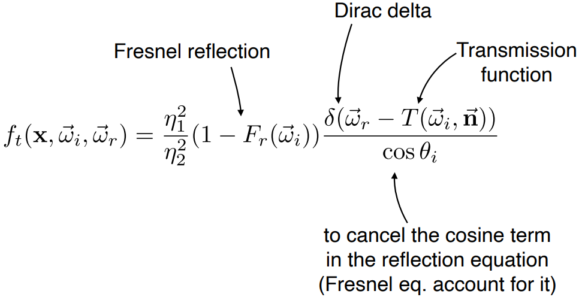

---
tags:
- CG
date: 30/09/2022
---

# Appearance Modeling

Different materials have different interactions with the light. The interaction between light and materials is described by Bidirectional Reflectance Distribution Function. 

## BRDF
BRDF means Bidirectional Reflectance Distribution Function, which provides a relation between incident radiance and differential reflected radiance. 

$$f_{r}(\mathbf{x}, \mathbf{w}_{i}, \mathbf{w}_{r}) = \frac{ dL_{r}(\mathbf{x},\mathbf{w}_{r}) }{ dE_{i}(\mathbf{x},\mathbf{w}_{i}) } =  \frac{ dL_{r}(\mathbf{x},\mathbf{w}_{r}) }{ L_{i}(\mathbf{x},\mathbf{w}_{i})\cos\theta_{i}d\mathbf{w}_{i} } \quad \left[ \frac{1}{\text{sr}} \right]$$

### Reflection Equation
$$L_{r}(\mathbf{x}, \mathbf{w}_{r}) = \int _{H^{2}} f_{r}(\mathbf{x}, \mathbf{w}_{i}, \mathbf{w}_{r})L_{i}(\mathbf{x},\mathbf{w}_{i})\cos\theta_{i}  \, d\mathbf{w}_{i} $$

The reflection equation describes a local illumination model:  

  

which results in the reflected radiance due to incident illumination from all directions.

### BRDF Properties

#### Helmholtz Reciprocity
$$
f_{r}(\mathbf{x},\mathbf{w}_{i},\mathbf{w}_{r}) = f_{r}(\mathbf{x},\mathbf{w}_{r},\mathbf{w}_{i})
$$

#### Energy Conservation
$$
\int _{H^{2}}f_{r}(\mathbf{x},\mathbf{w}_{i},\mathbf{w}_{r})\cos\theta_{i} \, d\mathbf{w}_{i} \leq 1
$$

#### Isotropic vs. Anisotropic
If the BRDF is unchanged as the material is rotated around the normal, then it is isotropic, otherwise it is anisotropic. Isotropic BRDFs are functions of just 3 variables $(\theta_{i}, \theta_{r}, \Delta \phi)$.

## Simple BRDF and BTDF Models

### Lambertian Reflection [Lambertian reflectance - Wikipedia](https://en.wikipedia.org/wiki/Lambertian_reflectance)

Lambertian reflectance is the property that defines an ideal "matte" or diffusely reflecting surface. The apparent brightness of a Lambertian surface to an observer ==is the same regardless of the observer's angle of view==.  

**For Lambertian reflection, the BRDF is a constant**. Thus we could write

$$\begin{align}
L_{r}(\mathbf{w},\mathbf{w}_{r})  & = \int _{H^{2}} f_{r}(\mathbf{x}, \mathbf{w}_{i}, \mathbf{w}_{r})L_{i}(\mathbf{x},\mathbf{w}_{i})\cos\theta_{i}  \, d\mathbf{w}_{i}  \\
  & = f_{r}\int _{H^{2}} L_{i}(\mathbf{x},\mathbf{w}_{i})\cos\theta_{i}  \, d\mathbf{w}_{i}  \\
  & = f_{r} E(\mathbf{x})
\end{align}$$

If all incoming light is reflected, then

$$\begin{align}
E(\mathbf{x})  & = B(\mathbf{x}) \\
B(\mathbf{x})  & = \int _{H^{2}}L_{r}(\mathbf{x})\cos \, d\mathbf{w}  \\
  & = L_{r}(\mathbf{x})\int _{H^{2}} \cos\theta\, d\mathbf{w} \\
  & = L_{r}(\mathbf{x})\pi 
\end{align}$$

which leads to 

$$f_{r} = \frac{1}{\pi}$$

In resume, for Lambertian reflection, the reflected radiance is 

$$L_{r} = \frac{\rho}{\pi} \int _{H^{2}}L_{i}(\mathbf{x},\mathbf{w}_{i})\cos\theta_{i} \, d\mathbf{w}_{i}$$

where $\rho\in [0,1]$ is the diffuse reflectance:
- $\rho=1$: all energy is (diffusely) reflected
- $\rho=0$: all energy is absorbed

### Ideal Specular Reflection
  

Every ray is reflected according to the geometrical rule without loss of energy. The BRDF is thus a delta function.
The reflected direction is 

$$\mathbf{w}_{r} = 2(\mathbf{w}_{i}\cdot\mathbf{n})\mathbf{n} - \mathbf{w}_{i}$$

### Ideal Specular Refraction
  

Every ray is refracted according to the geometrical rule without loss of energy. By Snell's law:
$$
\eta_{1}\sin\theta_{1} = \eta_{2}\sin\theta_{2}
$$
The refracted direction is 
$$
\mathbf{w}_{t} = - \frac{\eta_{1}}{\eta_{2}}(\mathbf{w}_{i} - (\mathbf{w}_{i}\cdot\mathbf{n})\mathbf{n}) - \mathbf{n}\sqrt{ 1 - \left( \frac{\eta_{1}}{\eta_{2}}\right)^{2}(1-(\mathbf{w}_{i}\cdot \mathbf{n})^{2})  }
$$

| Material    | Index of Refraction |
| ----------- | ------------------- |
| Vacuum      | 1                   |
| Air at STP  | 1.00029             |
| Ice         | 1.3                 |
| Water       | 1.33                |
| Crown glass | 1.52 - 1.65         |
| Diamond     | 2.417               | 

### Reflection + Refraction
#### Fresnel Equations
$$
\begin{aligned}
\rho_{\|} &=\frac{\eta_2 \cos \theta_1-\eta_1 \cos \theta_2}{\eta_2 \cos \theta_1+\eta_1 \cos \theta_2} \\
\rho_{\perp} &=\frac{\eta_1 \cos \theta_1-\eta_2 \cos \theta_2}{\eta_1 \cos \theta_1+\eta_2 \cos \theta_2}
\end{aligned}
$$
The reflection and refraction factor are then
$$
\begin{aligned}
F_r &=\frac{1}{2}\left(\rho_{\|}^2+\rho_{\perp}^2\right) \\
F_t &=1-F_r
\end{aligned}
$$

>[!Remark]
>The Fresnel coefficients are path-reversible, i.e. they are the same if we reverse the light path. This is easily proven by the fact that the $s$-polarized light has 
>$$R_{s} = \left[ \frac{\sin(\theta_{t}-\theta_{i})}{\sin(\theta_{t}+\theta_{i})} \right]^{2}$$ 
>and $p$-polarized light has
>$$R_{p} = \left[ \frac{\tan(\theta_{t}-\theta_{i})}{\tan(\theta_{t}+\theta_{i})} \right]^{2}$$
>Only if we have the same $\theta_{t}$ and $\theta_{i}$, we have the same coefficients.

#### BRDF of Specular Reflection

#### BRDF of Specular Refraction

