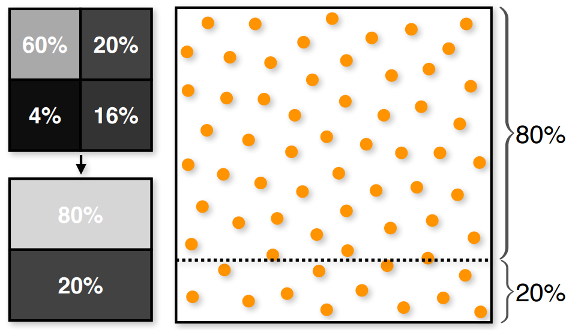

---
tags:
- CG
date: 11/10/2022
---

# Direct Illumination
## Definition
$$
\underbrace{ L_o\left(\mathbf{x}, \vec{\omega}_o\right) }_{ \text{outgoing} }=\underbrace{ L_e\left(\mathbf{x}, \vec{\omega}_o\right) }_{ \text{emission} }+\underbrace{ \int_{H^2} f_r\left(\mathbf{x}, \vec{\omega}_i, \vec{\omega}_o\right) L_i\left(\mathbf{x}, \vec{\omega}_i\right) \cos \theta_i d \vec{\omega}_i }_{ \text{incoming} }
$$
- Direct: $L_{i}$ comes directly from an emitter => Length of light path = 2
- Indirect: $L_{i}$ comes by bouncing off a scattering surface => Length of light path >= 2

## Formulation
Let's first ignore the $L_{e}$ part
$$
\int_{H^2} f_r\left(\mathbf{x}, \vec{\omega}_i, \vec{\omega}_o\right) L_i\left(\mathbf{x}, \vec{\omega}_i\right) \cos \theta_i d \vec{\omega}_i
$$

Estimation of the integral by [Monte Carlo Integration](Monte%20Carlo%20Integration.md):
$$
\left\langle L_r\left(\mathbf{x}, \vec{\omega}_r\right)^N\right\rangle=\frac{1}{N} \sum_{k=1}^N \frac{f_r\left(\mathbf{x}, \vec{\omega}_{i, k}, \vec{\omega}_r\right) L_e\left(r\left(\mathbf{x}, \vec{\omega}_{i, k}\right),-\vec{\omega}_{i, k}\right) \cos \theta_{i, k} d \vec{\omega}_{i, k}}{p_{\Omega}\left(\vec{\omega}_{i, k}\right)}
$$
Here $L_{i} = L_{e}$ since we only consider light directly from the light source.

However this integral is not good to evaluate since if the light is occluded, many samples will be wasted.

So we pass to surface area form

$$
\begin{aligned}
L_i\left(\mathbf{x}, \vec{\omega}_i\right) &=L_i(\mathbf{x}, \mathbf{y}) \\
L_r\left(\mathbf{x}, \vec{\omega}_r\right) &=L_r(\mathbf{x}, \mathbf{z}) \\
f_r\left(\mathbf{x}, \vec{\omega}_i, \vec{\omega}_r\right) &=f_r(\mathbf{x}, \mathbf{y}, \mathbf{z})
\end{aligned}
$$
The Jacobian determinant of this transformation is 
$$
d\vec{\omega}_{i} = \frac{|\cos\theta_{o}|}{\|\mathbf{x}-\mathbf{y}\|^{2}}dA
$$
**Hemispherical form**:
$$
L_r\left(\mathbf{x}, \vec{\omega}_r\right)=\int_{H^2} f_r\left(\mathbf{x}, \vec{\omega}_i, \vec{\omega}_r\right) L_i\left(\mathbf{x}, \vec{\omega}_i\right) \cos \theta_i d \vec{\omega}_i
$$
**Surface area form**:
$$
L_r(\mathbf{x}, \mathbf{z})=\int_A f_r(\mathbf{x}, \mathbf{y}, \mathbf{z}) L_i(\mathbf{x}, \mathbf{y}) G(\mathbf{x}, \mathbf{y}) d A(\mathbf{y})
$$
where $G(\mathbf{x},\mathbf{y})$ is the geometry term
$$
G(\mathbf{x},\mathbf{y}) = V(\mathbf{x},\mathbf{y}) \frac{\overbrace{ |\cos\theta_{i}| }^{ \text{Original foreshortening term} }|\cos\theta_{o}|}{\|\mathbf{x}-\mathbf{y}\|^{2}}
$$
and the $V(\mathbf{x},\mathbf{y})$ is the visibility term
$$
V(\mathbf{x},\mathbf{y})=
\begin{cases}
1 : \quad \text{visible} \\
0: \quad \text{not visible}
\end{cases}
$$

## Sampling Light Sources

### Point Light
- Defined by a point $\mathbf{p}$ and a power $\Phi$.
- Omnidirectional emission from a single point
$$
L_{r}(\mathbf{x}, \mathbf{z}) = \frac{\Phi}{4\pi} f_{r}(\mathbf{x}, \mathbf{p},\mathbf{z}) V(\mathbf{x},\mathbf{p}) \frac{|\cos\theta_{i}|}{\|\mathbf{x}-\mathbf{p}\|^{2}}
$$

### Spot Light
- Defined by a point $\mathbf{p}$ and a directionally dependent radiant intensity $I$
$$
L_r(\mathbf{x}, \mathbf{z})=I(\mathbf{p}, \mathbf{x}) f_r(\mathbf{x}, \mathbf{p}, \mathbf{z}) V(\mathbf{x}, \mathbf{p}) \frac{\left|\cos \theta_i\right|}{\|\mathbf{x}-\mathbf{p}\|^2}
$$

### Directional Light
- Defined by a direction $\vec{\omega}$ and radiance $L_{d}(\vec{\omega})$ coming from direction $\vec{\omega}$
$$
L_r\left(\mathbf{x}, \vec{\omega}_r\right)=f_r\left(\mathbf{x}, \vec{\omega}, \vec{\omega}_r\right) V(\mathbf{x}, \vec{\omega}) L_d(\vec{\omega}) \cos \theta
$$

Note that the above light sources don't have volume, so we don't need to and can't sample them.

### Quad/Area Light

An area light where every surface point emits radiance $L_{e}$. It can be uniformly sampled.

### Sphere Light
Typically defined using a point $\mathbf{p}$, radius $r$ and emitted power $\Phi$.

**Sample Method**
- Uniformly sample sphere area -> more than half of the samples not visible
- Uniformly sample area of the visible spherical cap
- Uniformly sample solid angle subtended by the sphere

> [!Remark] 
> make sure to convert the PDF into the measure of the integral
> $$\begin{align}p_{A}(\mathbf{x}) & = \frac{\cos\theta}{d^{2}} p_{\Omega}(\vec{\omega})  \\p_{\Omega}(\vec{\omega}) & = \frac{d^{2}}{\cos \theta}p_{A}(\mathbf{x})\end{align}$$
> 

### Mesh Light
- An emissive mesh where ==every surface point== emits radiance $L_{e}$

- Preprocess
build a discrete PDF $p_{\Delta}$ for choosing polygons(triangles) proportional to their area
$$
p_{\Delta}(i) = \frac{A(i)}{\sum A(k)}
$$

- Run-time
	- sample a polygon $i$ and a point $\mathbf{x}$ on $i$
	- compute the PDF of choosing the point $\mathbf{x}$
$$
p_{A}(\mathbf{x}) = p_{\Delta}(i)p_{A}(\mathbf{x}|i) = \frac{1}{\sum A(k)}
$$

## Importance Sampling
We could place samples intelligently to reduce variance.

$$
L_r\left(\mathbf{x}, \vec{\omega}_r\right)=\int_{H^2} f_r\left(\mathbf{x}, \vec{\omega}_i, \vec{\omega}_r\right) L_i\left(\mathbf{x}, \vec{\omega}_i\right) \cos \theta_i d \vec{\omega}_i
$$
Three terms could be used for importance sampling:
- $\cos$ term
- BRDF
- Incident radiance

### $\cos$ term
For ambient occlusion
$$
L_{r}(\mathbf{x}) = \frac{\rho}{\pi} \int _{H^{2}} V(\mathbf{x}, \vec{\omega}_{i}) \cos\theta_{i} \, d\vec{\omega}_{i} 
$$
By [Monte Carlo Integration](Monte%20Carlo%20Integration.md)
$$
L_{r}(\mathbf{x}) = \frac{\rho}{\pi N}\sum_{k=1}^{N} \frac{V(\mathbf{x},\vec{\omega}_{i,k})\cos \theta_{i,k}}{p(\vec{\omega}_{i,k})}
$$
If we uniformly sample the hemisphere

$$
\begin{align}
p(\vec{\omega}_{i,k})  & = \frac{1}{2\pi} \\
L_{r}(\mathbf{x})  & \simeq \frac{2\rho}{N}\sum_{k=1}^{N} V(\mathbf{x}, \vec{\omega}_{i,k})\cos\theta_{i,k}
\end{align}
$$

If we use cosine weighted importance sampling

$$
\begin{align}
p(\vec{\omega}_{i,k})  & = \frac{\cos\theta_{i,k}}{\pi} \\
L_{r}(\mathbf{x})  & \simeq \frac{\rho}{N}\sum_{k=1}^{N} V(\mathbf{x},\vec{\omega}_{i,k})
\end{align}
$$

### BRDF
Importance sampling the BRDF

For  model, we could use the normalized Phong-like $\cos^{2}\alpha$ lobe
$$
\begin{aligned}
p(\theta, \phi) &=\frac{\alpha+2}{2 \pi} \cos ^\alpha \theta \\
(\theta, \phi) &=\left(\cos ^{-1}\left(\left(1-\xi_1\right)^{\frac{1}{\alpha+2}}\right), 2 \pi \xi_2\right)
\end{aligned}
$$

For BRDFs with multiple lobes:
- Probabilistically choose a lobe, e.g. proportional to the coefficient
- Sample a direction using the lobe
$$
p_{\Omega}(\omega) = p_{1}(l)p_{\Omega}(\omega|l)
$$

Example:
- Blend Microfacet model
	- $k_{d}$ diffuse coefficient
	- $k_{s}$ specular/glossy coefficient
- Disney BSDF

### Incident Radiance
For direct illumination we can explicitly ==sample emissive surfaces==

We could combine multiple sampling strategies using %7Cmultiple%20importance%20sampling).

## Environment Lighting
The environment of a scene is represented with one or more images. The images “wrap” the virtual scene serving as a distant sources of illumination. 

$$
\begin{aligned}
L_r\left(\mathbf{x}, \vec{\omega}_r\right) &=\int_{\Omega} f_r\left(\vec{\omega}_i, \vec{\omega}_r\right) L_i\left(\mathbf{x}, \vec{\omega}_i\right) \cos \theta_i d \vec{\omega}_i \\
&=\int_{\Omega} f_r\left(\vec{\omega}_i, \vec{\omega}_r\right) L_{\mathrm{env}}\left(\vec{\omega}_i\right) V\left(\mathbf{x}, \vec{\omega}_i\right) \cos \theta_i d \vec{\omega}_i
\end{aligned}
$$

We could model the environment using
- Latitude/longitude map
- Cube map(sky box)
- Octahedron map
- HEALPix

### Importance Sampling $L_{\text{env}}$
#### Marginal/Conditional CDF Method
Assuming we are using the lat/long parameterization

and we reduce the variance by making 
$$
p(\theta,\phi) \propto L_{\text{env}}(\theta,\phi)\sin \theta
$$
The $\sin$ term is because if we want to integrate over $S^{2}$, we have
$$
\begin{aligned}
\int_{S^2} f(\vec{\omega}) d \vec{\omega} &=\int_0^{2 \pi} \int_0^\pi f(\theta, \phi) \sin \theta d \theta d \phi \\
& \approx \frac{1}{N} \sum_{i=1}^N \frac{f\left(\theta_i, \phi_i\right) \sin \theta_i}{p\left(\theta_i, \phi_i\right)}
\end{aligned}
$$
the $\sin$ term will effectively cancel out.

Now we can draw samples from the joint PDF $p(\theta,\phi)\propto L_{\text{env}}(\theta,\phi)\sin\theta$.
1. Create scalar version $L'(\theta,\phi)$ of $L_{\text{env}}(\theta,\phi)\sin\theta$.

| Substeps                   |                |
| -------------------------- | -------------- |
| Scalar version(avg, max)   |  |
| Multiplied by $\sin\theta$ |  |

2. Marginalization

3. Conditional PDFs
Normalize each row to get the conditional PDF.

4. Sampling

#### Hierarchical Warping Method
`Input`:
- a point set
- hierarchical representation of density function

| steps | representations                      |
| ----- | ------------------------------------ |
| 1     |  |
| 2     |  |
| 3     |  |

