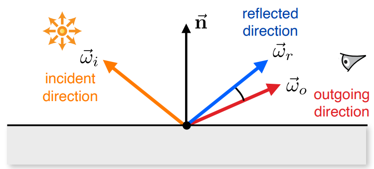
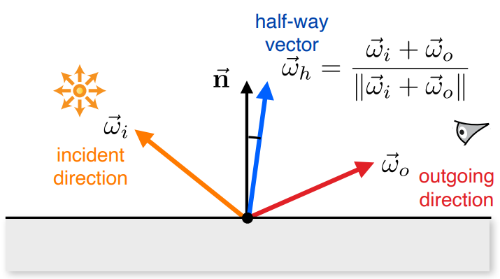
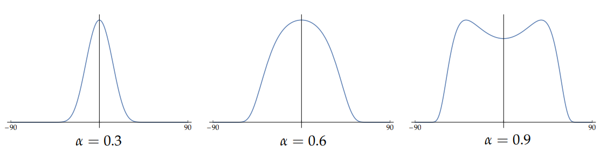
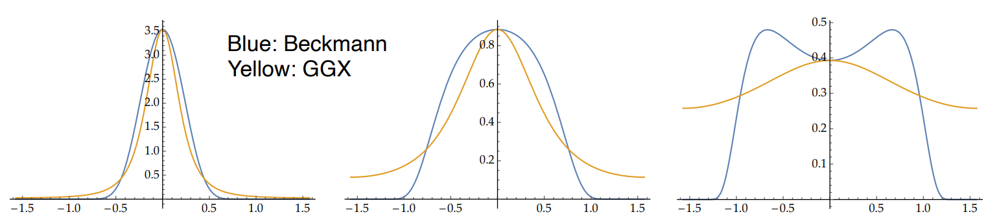
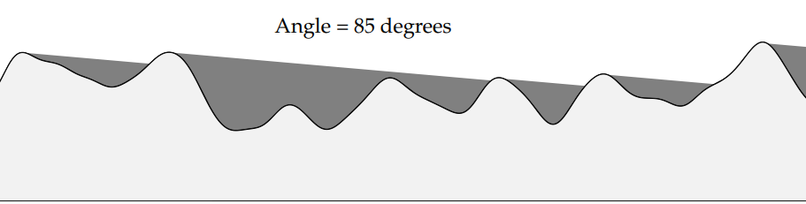

---
tags:
- CG
date: 18/10/2022
---

# Advanced BRDF Models

Many surfaces are not perfectly smooth. We need an empirical model to account for this, which is simple and fast to evaluate.

## Normalized Phong

Normalized exponentiated cosine lobe

$$
f_{r}(\boldsymbol{\omega}_{o}, \boldsymbol{\omega}_{i}) = \frac{e+2}{2\pi}(\boldsymbol{\omega}_{r} \cdot \boldsymbol{\omega}_{o})^{e}
$$

where $\boldsymbol{\omega}_{r} = (2\mathbf{n}(\mathbf{n}\cdot \boldsymbol{\omega}_{i})-\boldsymbol{\omega}_{i})$.

- Blur the reflection rays in a cone about the mirror direction
- Perfect mirror reflection of a blurred light

## Blinn-Phong
Blur in normal domain instead of the reflection directions

$$
f_{r}(\boldsymbol{\omega}_{o}, \boldsymbol{\omega}_{i}) = \frac{e+2}{2\pi}(\boldsymbol{\omega}_{h}\cdot \mathbf{n})^{e}
$$

where $\boldsymbol{\omega}\_{h}$ is the half-way vector

$$
\boldsymbol{\omega}\_{h} = \frac{\boldsymbol{\omega}\_{i}+\boldsymbol{\omega}\_{o}}{\|\boldsymbol{\omega}\_{i} + \boldsymbol{\omega}\_{o}\|}
$$

Empirical glossy models have limitations: 
- not physically-based  
- (often) not reciprocal 
- not energy-preserving (can be normalized) 
- (often) no Fresnel effects 
- cannot accurately model appearance of many glossy surfaces 
- may generate directions below the surface

## Microfacet Theory
Assumptions:
- surface consists of tiny facets
- the differential area being illuminated is relatively large compared to the size of microfacets
- a facet can be perfectly specular or diffuse

$$
f(\boldsymbol{\omega}_{i}, \boldsymbol{\omega}_{o}) = \frac{\overbrace{ F(\boldsymbol{\omega}_{h}, \boldsymbol{\omega}_{o}) }^{ \text{Fresnel coefficient} } \cdot \overbrace{ D(\boldsymbol{\omega}_{h}) }^{ \text{Microfacet distribution} } \cdot \overbrace{ G(\boldsymbol{\omega}_{i}, \boldsymbol{\omega}_{o}) }^{ \text{Shadowing/masking} }}{\underbrace{ 4|(\boldsymbol{\omega}_{i} \cdot \mathbf{n})(\boldsymbol{\omega}_{o} \cdot \mathbf{n})| }_{ \text{Energy conservation} }}
$$

where $\boldsymbol{\omega}_{h}$ is the halfway vector as in .  

### Microfacet Distribution
Probability density function over projected solid angle, which must be normalized:

$$
\int _{H^{2}} D(\vec{\omega}_{h})\cos\theta_{h} \, d\vec{\omega} _{h}
$$

#### The Beckmann Distribution
The Beckmann distribution assumes that the slopes follow a Gaussian distribution.

$$
\large
D(\boldsymbol{\omega}_{h}) = \frac{1}{\pi\alpha^{2}\cos ^{4}\theta_{h}} e^{ - \tan ^{2} \theta_{h}/\alpha^{2} }
$$

where $\alpha$ is the roughness parameter or diffuse parameter.

#### Blinn Distribution

$$
D(\vec{\omega}_{h}) = \frac{e+2}{2\pi}(\vec{\omega}_{h}\cdot \vec{n})^{e}
$$

#### GGX distribution

### Shadowing/masking
Microfacets can be shadowed and/or masked by other microfacets

Each microfacet distribution typically has its respective shadowing and masking term. 

Beckmann distribution uses

$$
G(\vec{\omega}) = \frac{2}{1+\text{erf}(s)+\frac{1}{s \sqrt{ \pi }}e^{ -s^{2} }}
$$

where 

$$
s = \frac{1}{\alpha \tan\theta}
$$

or in approximated version

$$
G(\vec{\omega}) \simeq 
\begin{cases}
\frac{3.535+2.181s^{2}}{1+2.276s+2.577s^{2}},  & \quad s<1.6 \\
1,  & \quad \text{otherwise}
\end{cases}
$$

and 

$$
G(\vec{\omega}_{i}, \vec{\omega}_{o}) = G(\vec{\omega}_{i}) \cdot G(\vec{\omega}_{o})
$$

Blinn Distribution uses

$$
G\left(\vec{\omega}_i, \vec{\omega}_o\right)=\min \left(1, \frac{2\left(\overrightarrow{n} \cdot \vec{\omega}_h\right)\left(\overrightarrow{n} \cdot \vec{\omega}_i\right)}{\left(\vec{\omega}_h \cdot \vec{\omega}_i\right)}, \frac{2\left(\overrightarrow{n} \cdot \vec{\omega}_h\right)\left(\overrightarrow{n} \cdot \vec{\omega}_o\right)}{\left(\vec{\omega}_h \cdot \vec{\omega}_o\right)}\right)
$$

### Sampling the Microfacet Model

$$
f\left(\vec{\omega}_i, \vec{\omega}_o\right)=\frac{F\left(\vec{\omega}_h, \vec{\omega}_o\right) \cdot D\left(\vec{\omega}_h\right) \cdot G\left(\vec{\omega}_i, \vec{\omega}_o\right)}{4\left|\left(\vec{\omega}_i \cdot \overrightarrow{\mathbf{n}}\right)\left(\vec{\omega}_o \cdot \overrightarrow{\mathbf{n}}\right)\right|}
$$

Note that the BRDF function is relevant with the half-way vector $\vec{\omega}_{h}$. We need to sample this vector to determine the BRDF function value. The general recipe is 
- randomly generate a $\vec{\omega}_{h}$ with PDF proportional to $D$
- reflect incident direction $\vec{\omega}\_{i}$ about $\vec{\omega}\_{h}$ to obtain $\vec{\omega}\_{o}$
- convert PDF($\vec{\omega}\_{h}$) to PDF($\vec{\omega}\_{o}$) 

$$
p(\vec{\omega}_{o}) = p(\vec{\omega}_{h}) \frac{ d\vec{\omega}_{h} }{ d\vec{\omega}_{o} } = p(\vec{\omega}_{h}) \frac{1}{4|\vec{\omega}_{o}\cdot \vec{\omega}_{h}|} 
$$

## The Oren-Nayar Model
Assumes that the facets are diffuse

No analytical solution; fitted approximation

$$
\begin{aligned}
&f_r\left(\vec{\omega}_o, \vec{\omega}_i\right)=\frac{\rho}{\pi}\left(A+B \max \left(0, \cos \left(\phi_i-\phi_o\right)\right) \sin \alpha \tan \beta\right)\\
&A=1-\frac{\sigma^2}{2\left(\sigma^2+0.33\right)} \quad B=\frac{0.45 \sigma^2}{\sigma^2+0.09}\\
&\alpha=\max \left(\theta_i, \theta_o\right) \quad \beta=\min \left(\theta_i, \theta_o\right)
\end{aligned}
$$

Ideal Lambertian is a special case of $\sigma = 0$.

## Data-Driven BRDFs

### The MERL Database
[A data-driven reflectance model | ACM Transactions on Graphics](https://dl.acm.org/doi/10.1145/882262.882343)
[MERL – Mitsubishi Electric Research Laboratories](https://www.merl.com/brdf/)

### The RGL-EPFL Material Database
[An adaptive parameterization for efficient material acquisition and rendering | ACM Transactions on Graphics](https://dl.acm.org/doi/10.1145/3272127.3275059)
[Material database | RGL (epfl.ch)](http://rgl.epfl.ch/materials)
