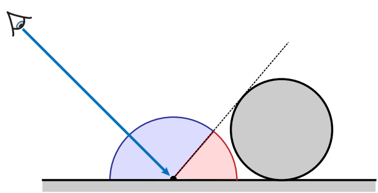

---
tags:
- CG
date: 14/10/2022
---

# Monte Carlo Integration
Monte Carlo integration is a numerical integration method which derives from the idea of expectation in probability theory.
## Monte Carlo Method
**Idea**:
The expectation of a function of a random variable is 
$$
\mathbb{E}[f(x)] = \int _{D}f(x)p(x) \, dx \simeq \frac{1}{N}\sum_{i=1}^{N} f(x_{i})
$$
which gives the idea of Monte Carlo integration
$$
\int _{D}f(x) \, dx  = \int _{D} \frac{f(x)}{p(x)}p(x) \, dx \simeq \frac{1}{N} \sum_{i=1}^{N} \frac{f(x_{i})}{p(x_{i})} = F_{N}
$$

**Example**:
$$
F = \int _{a}^{b} e^{ \sin(3x^{2}) } \, dx \simeq F_{N} = \frac{1}{N}\sum_{i=1}^{N} \frac{f(x_{i})}{p(x_{i})}
$$
where we use uniform distribution, i.e. $p(x_{i})= \frac{1}{b-a}$. Below is the code for integration
```cpp
double integrate(int N, double a, double b) 
{ 
	double x, sum=0.0; 
	for (int i = 0; i < N; ++i) 
	{ 
		x = a + drand48()*(b-a); 
		sum += exp(sin(3*x*x)); 
	} 
	
	return sum / double(N); 
}
```

**Monte Carlo Estimator**
The statistic $F_{N}$ is called Monte Carlo estimator
- unbiased estimator
- extension to higher dimensions straightforward
- convergence in $O\left( \frac{1}{\sqrt{ N }} \right)$ cause $V[F_{N}]=\frac{1}{N}V[F_{1}]$ => variance ~ $1/N$, std ~ $1/\sqrt{N}$

>**Proof of Convergence Rate**
>$$\begin{aligned}V\left[F_N\right] & =V\left[\frac{1}{N} \sum_{i=0}^N \frac{f\left(X_i\right)}{p\left(X_i\right)}\right] =\frac{1}{N^2} V\left[\sum_{i=0}^N \frac{f\left(X_i\right)}{p\left(X_i\right)}\right] \\& =\frac{1}{N^2} \sum_{i=0}^N V\left[\frac{f\left(X_i\right)}{p\left(X_i\right)}\right]=\frac{1}{N} V\left[\frac{f(X)}{p(X)}\right]=\frac{1}{N} V\left[F_1\right]\end{aligned}$$

**Pros**:
- flexible
- easy to implement
- easily handle complex integrands
- efficient for high dimensional integrands

**Cons**:
- variance(noise)
- slow convergence $O\left( \frac{1}{\sqrt{ N }} \right)$


## Importance Sampling
Assume $p(x) = cf(x)$
$$
\int p(x) \, dx = 1 \to c = \frac{1}{\int f(x) \, dx }
$$
Monte Carlo estimator is
$$
\frac{f(X_{i})}{p(X_{i})} = \frac{1}{c} = \int f(x) \, dx
$$
which is infeasible since we don't know the integral. But ==if pdf is similar to integrand==, ==variance can be significantly reduced==


#### Example: Ambient Occlusion
Consider diffuse objects illuminated by an ambient white sky, the rendering function is as below and can be simplified by the fact that the BRDF and incident light are constant.
$$
\begin{aligned}
L_r\left(\mathbf{x}, \vec{\omega}_r\right) &=\int_{H^2} f_r\left(\mathbf{x}, \vec{\omega}_i, \vec{\omega}_r\right) L_i\left(\mathbf{x}, \vec{\omega}_i\right) \cos \theta_i d \vec{\omega}_i \\
L_r(\mathbf{x}) &=\frac{\rho}{\pi} \int_{H^2} V\left(\mathbf{x}, \vec{\omega}_i\right) \cos \theta_i d \vec{\omega}_i
\end{aligned}
$$



$$
L_r(\mathbf{x}) \approx \frac{\rho}{\pi N} \sum_{k=1}^N \frac{V\left(\mathbf{x}, \vec{\omega}_{i, k}\right) \cos \theta_{i, k}}{p\left(\vec{\omega}_{i, k}\right)}
$$

**Uniform hemispherical sampling**


$$
\begin{gathered}
p\left(\vec{\omega}_{i, k}\right)=1 / 2 \pi \\
L_r(\mathbf{x}) \approx \frac{2 \rho}{N} \sum_{k=1}^N V\left(\mathbf{x}, \vec{\omega}_{i, k}\right) \cos \theta_{i, k}
\end{gathered}
$$

**Cosine-weighted importance sampling**


$$
\begin{gathered}
p\left(\vec{\omega}_{i, k}\right)=\cos \theta_{i, k} / \pi \\
L_r(\mathbf{x}) \approx \frac{\rho}{N} \sum_{k=1}^N V\left(\mathbf{x}, \vec{\omega}_{i, k}\right)
\end{gathered}
$$

### Combining Multiple Strategies
We could sample from the average PDF
$$
\frac{1}{N} \sum_{i=1}^{N} \frac{f(x_{i})}{0.5(p_{1}(x_{i})+p_{2}(x_{i}))}
$$
Note that it's no use to average two different estimators:
$$
\frac{0.5}{N_1} \sum_{i=1}^{N_1} \frac{f\left(x_i\right)}{p_1\left(x_i\right)}+\frac{0.5}{N_2} \sum_{i=1}^{N_2} \frac{f\left(x_i\right)}{p_2\left(x_i\right)}
$$
since variance is additive.

## Multiple Importance Sampling(MIS)
In MC integration, variance is high when the PDF is not proportional to the integrand
### Ways of Combination
**Naïve combination of $2$ sampling strategies(no use)**：
Sample $N_{1}$ points using PDF $p_{1}$ then sample $N_{2}$ points using PDF $p_{2}$
$$
\left\langle F^{N_1+N_2}\right\rangle=\frac{w_1}{N_1} \sum_{i=1}^{N_1} \frac{f\left(x_i\right)}{p_1\left(x_i\right)}+\frac{w_2}{N_2} \sum_{i=1}^{N_2} \frac{f\left(x_i\right)}{p_2\left(x_i\right)}
$$

**Weighted combination of $2$ sampling strategies**
$$
\left\langle F^{N_1+N_2}\right\rangle=\frac{1}{N_1} \sum_{i=1}^{N_1} w_{1}(x_{i})\frac{f\left(x_i\right)}{p_1\left(x_i\right)}+\frac{1}{N_2} \sum_{i=1}^{N_2} w_{2}(x_{i}) \frac{f\left(x_i\right)}{p_2\left(x_i\right)}
$$
where $w_{1}(x) + w_{2}(x) =1$. Note that the weight here is different for every point.

**Weighted combination of $M$ sampling strategies**
$$
\left\langle F^{\sum N_s}\right\rangle=\sum_{s=1}^M \frac{1}{N_s} \sum_{i=1}^{N_s} w_s\left(x_i\right) \frac{f\left(x_i\right)}{p_s\left(x_i\right)}
$$
where $\sum_{s=1}^{M}  w_{s}(x) = 1$

### Choice of the Weights
- Balance heuristic(provably good)
$$
w_{s}(x) = \frac{N_{s}p_{s}(x)}{\sum_{j}N_{j}p_{j}(x)}
$$
- Power heuristic
$$
w_{s}(x) = \frac{(N_{s}p_{s}(x))^{\beta}}{\sum_{j}(N_{j}p_{j}(x))^{\beta}}
$$

### One-Sample Model
$$
\left\langle F^1\right\rangle=w_s(x) \frac{f(x)}{q_s p_s(x)}
$$
where $q_{s}$ is the probability of using $s$-th strategy. If we derive $q_{s}$ from the multi-sample model we have
$$
q_{s} = \frac{N_{s}}{\sum N_{j}}
$$
And the balance heuristic for the one-sample mode gives
$$
w_{s}(x) = \frac{N_{s}p_{s}(x)}{\sum_{j} N_{j}p_{j}(x)} = \frac{q_{s}p_{s}(x)}{\sum_{j}q_{j}p_{j}(x)}
$$
Plug into the one-sample model we have 
$$
\left\langle F^1\right\rangle=w_s(x) \frac{f(x)}{q_s p_s(x)}=\frac{q_s p_s(x)}{\sum_j q_j p_j(x)} \frac{f(x)}{q_s p_s(x)}=\frac{f(x)}{\sum_j q_j p_j(x)}
$$
which turns out that the probability is a linear combination of PDFs. 

In a word, if we want to use multiple sample strategy, define a new PDF to be their linear combination. 
$$
\langle F^{N} \rangle = \frac{1}{N} \sum_{i=1}^{N} \frac{f(x_{i})}{\sum_{j}q_{j}p_{j}(x_{i})}
$$
The strategy works because if we have a large value $f(x_{i})$ we should also have a relatively large value in the denominator(as long as at least one PDF is large)

