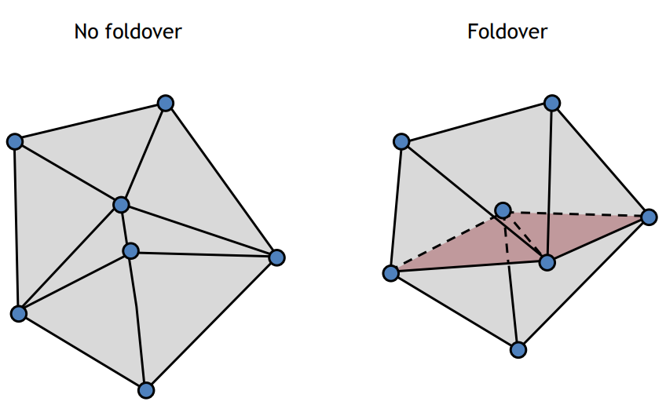
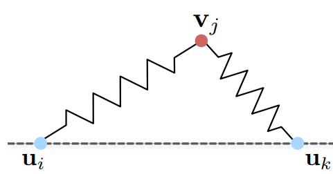
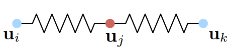
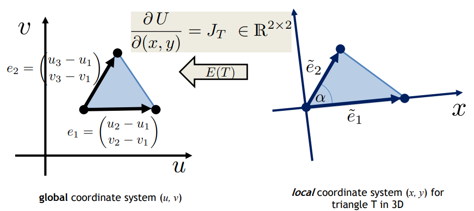
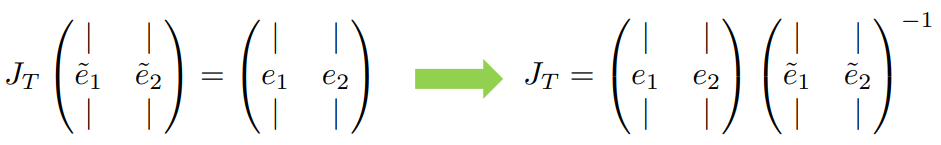

---
tags:
- ShapeModeling
---

# Mesh Parameterization
## Setting
We want to find a mapping $U$ of the mesh from the 3D vertices to a 2D domain $\Omega$. 
$$U: V\rightarrow S$$
where $V$ is the set of vertices and $S$ the set of corresponding 2D representations. Each mesh vertex thus has a corresponding 2D positions noted by $U(\mathbf{v}_i)=(u_i,v_i)$. The inverse mapping from 2D to 3D is called $P$.

Note that we do not wish to find an analytic expression of $U$, which is often infeasible and we only want to find the ==mapping of the vertices instead of  the whole space==. For points other than vertices that we want to add to $S$, we use the [Barycentric Coordinates](Barycentric%20Coordinates), i.e. inside each triangle, the mapping is affine.

- Benefits of parameterization
	1. Makes operations in 2D and then map those actions onto the 3D surface.
	2. It's often easier to operate in the 2D domain
	3. Mesh parameterization allows to use some notions from continuous surface theory.
- Applications:
	1. Texture mapping
	2. Normal/bump mapping
	3. Remeshing
	4. Compression

## Methods
### Good parameterization
A good parameterization should ensure 
1. Bijectivity
First thing first, we do not want foldovers in the 2D domain.

For closed surface we can cut them or segment them to ensure there exists a mapping from 3D to 2D.

2. Small/No distortions(of triangles)
The first fundamental form measures the length and angle change. $$I = \begin{pmatrix}E & F \\ F & G\end{pmatrix} = \begin{pmatrix}\mathbf{p}_u^{\top}\mathbf{p}_{u} & \mathbf{p}_u^{\top}\mathbf{p}_{v} \\ \mathbf{p}_u^{\top}\mathbf{p}_{v} & \mathbf{p}_v^{\top}\mathbf{p}_{v}\end{pmatrix}$$
The eigen values of $I$ tells us the maximal/minimal stretching of a tangent vector. In a simple case of affine mapping 
$$P: \mathbb{R}^2 \rightarrow \mathbb{R}^3, \quad P(\mathbf{u}) = A\mathbf{u} + \mathbf{c}$$
then $A$ is the Jacobian and the first fundamental form is $I=A^\top A$.
The SVD of $A$ is $U\Lambda V^\top$ where 
$$\Lambda = \begin{pmatrix}\Gamma & \\ & \sigma\end{pmatrix}$$
And we want to minimize the imaginary energy $E(T) = \sqrt{\Gamma^2+\sigma^2}$ or any other form of energy.

### General approach
We try to minimize a weighted sum of energy
$$\underset{(u_1,v_1),\cdots,(u_n,v_n)}{\text{argmin}} \sum_T A_T E(T)$$
Different methods differ in the way of define $A_T$ and $E(T)$. A specific parameterization is called **conformal** parameterization where angles are preserved and circles are mapped to circles.

### Convex/Harmonic mapping 
#### Convex mapping
An intuitive idea is that in the 2D domain, the Laplacian operator should give $0$, that is 
$$\Delta (\mathbf{u}_i) =0, \quad i=1,\dots,n$$
The discrete Laplacian operator should give the same result
$$L(\mathbf{u_i})=\frac{1}{W_i}\sum_{j\in\mathcal{N}(i)}w_{ij}(\mathbf{u}_j-\mathbf{u}_i)=0$$
However, to we need to **fix a boundary** to make the system solvable(or we have a infinite set of solutions). The boundary is made by indicating the corresponding 2D mapping of a set of vertices(often is also the boundary of the 3D mesh).

#### Harmonic mapping
Harmonic mapping is equivalent to convex mapping but from a different point of view. Imagine that the edges between vertices are now springs. 

We want to find minimum-energy state where all vertices lie in the 2D plane

The spring energy is then 
$$E(\mathbf{u}_1,\dots,\mathbf{u}_n)=\sum_i\sum_{j\in\mathcal{N}(i)} \frac{1}{2}k_{ij}\|\mathbf{u}_i-\mathbf{u}_j\|^2$$
Taking the derivative w.r.t. $\mathbf{u}_i$ and set it to 0, we get $n$ equations
$$\sum_{j\in\mathcal{N}(i)}k_{ij}\mathbf{u}_i - \sum_{j\in\mathcal{N}(i)\backslash B}k_{ij}\mathbf{u}_j=\sum_{j\in\mathcal{N}(i)\cap B}k_{ij}\mathbf{u}_j$$
which is equivalent to 

$$\begin{pmatrix}\sum_{j\in\mathcal{N}(1)}k_{1j} & * & \cdots & * \\ * & \sum_{j\in\mathcal{N}(2)}k_{2j} & \cdots & * \\ \vdots & * & \ddots & * \\ * & * & \cdots & \sum_{j\in\mathcal{N}(n)}k_{nj} \end{pmatrix}
\begin{pmatrix}\mathbf{u}_1 \\ \mathbf{u}_2 \\ \vdots \\ \mathbf{u}_n\end{pmatrix}
=\begin{pmatrix}\bar{\mathbf{u}}_1 \\ \bar{\mathbf{u}}_2  \\ \vdots \\ \bar{\mathbf{u}}_n\end{pmatrix}$$

where $B$ is the set of boundary vertices and $\bar{\mathbf{u}}_i$ is $\sum_{j\in\mathcal{N}(i)\cap B}k_{ij}\mathbf{u}_j$ and $*$ replaces $-k_{ij}\mathbb{1}_{j\in \mathcal{N}(i)\backslash B}$. We notice that the matrix on the l.h.s. is actually the Laplacian operator. 
We have two choices of different weights. 
1. **uniform** where we set $k_{ij}=1$.
2. **cotan** where we set $k_{ij}=\cot \phi_{ij}+ \cot \phi_{ji}$.

In the following methods, we remove the fix boundary requirement and thus have a better mapping. 

### Interlude: linear transformation from 3D triangles to 2D triangles
We know that 3 points fix a plane, thus we can construct a local 2D coordinate system for each mesh triangle. Thus the parameterization can be modeled as a linear transformation(matrix multiplication). 

The transformation matrix $J_T$ is applied to vectors in the local coordinate system $(x,y)$ and maps them to the global coordinate system $(u,v)$.

Or explicitly
$$J_T
=\begin{pmatrix}u_2-u_1 & u_3-u_1 \\ v_2-v_1 & v_3-v_1\end{pmatrix}\begin{pmatrix}y_2-y_1 & y_3-y_1 \\ x_2-x_1 & x_3-x_1\end{pmatrix}^{-1}$$
which is linear in the unknown $\{u_i,v_i\}$. Moreover, we can easily see that the Jocabian is translation-invariant. 
The good mapping that we desire should have minimum distortion which means we want to **preserve the triangle shape**. Ideally $J_T$ should be a multiplication of rescaling and rotation matrix.

### LSCM(Least Squares Conformal Maps)
In the LSCM setting, we allow rescaling and rotation. An ideal Jacobian should be like $$J_T
= \begin{pmatrix}s & 0 \\ 0 & s\end{pmatrix}\begin{pmatrix}\cos\phi & \sin\phi \\ -\sin\phi & \cos\phi\end{pmatrix}
=\begin{pmatrix}s\cos\phi & s\sin\phi \\ -s\sin\phi & s\cos\phi\end{pmatrix}=\begin{pmatrix}a & b \\ -b & a\end{pmatrix}$$
Let 
$$J_T=
\begin{pmatrix}j_{11}(X) & j_{12}(X) \\ j_{21}(X)  & j_{22}(X)\end{pmatrix}$$
where $j_{11}(X)$, $j_{12}(X)$, $j_{21}(X)$, $j_{22}(X)$ are linear in $X$ and $X$ is the set of $\{u_i,v_i\}$. The LSCM energy is defined to be 
$$E_{LSCM}(X) = \sum_{\text{triangles }T}A_TE_{LSCM}(T)$$
where $E_{LSCM}(T) = (j_{11}(X)-j_{22}(X))^2+(j_{12}(X)+j_{21}(X))^2$ and $A_T$ is the area of the triangle.

### ARAP(As Rigid/Isometric As Possible)
ARAP method seeks to only allow rotation transformations. The ARAP energy is defined to be the distance between $J_T$ and a $2\times 2$ rotation matrix $R_T$:
$$E_{ARAP}(T) = \underset{R_T\in SO(2)}{\min}\|J_T-R_T\|^2_F$$
where $SO(2)$ is the ensemble of all $2\times 2$ rotation matrices. We use local-global iterations to efficiently minimize the ARAP energies:
1. Initialize $X$ with LSCM or harmonic mapping.
2. For each $T$ i.e. each face, compute $R_T$ using the current value of $X$ i.e. $\{u_i, v_i\}$: find the [SVD](SVD(Singular%20Value%20Decomposition)) of $J_T = U\Sigma V^\top$ and $R_T= UV^\top$.(Feasible because $J_T$ is square)
3. Fix $R_T$ and solve for new $X$.
4. If !(stopping criterion), go to 2.

### Calculation details
We've already introduced the mapping from the local frame to 2D plane in . From that we know that ==the Jacobian is defined per face i.e. one transformation per triangle.==
We now write out the Jacobian explicitly 
$$J_T=
\begin{pmatrix}
\nabla_x u & \nabla_y u \\
\nabla_x v & \nabla_y v
\end{pmatrix}$$
Consider that we associate two values $u_i$ and $v_i$ to its corresponding 3D vertex. We have in our hands ==the discrete local gradient operator== $D_x$ and $D_y$ to replace $\nabla_x$ and $\nabla_y$. Then the Jacobian $J_T$ is given by 
$$J_T=
\begin{pmatrix}
D_x \mathbf{u} & D_y \mathbf{u} \\
D_x \mathbf{v} & D_y \mathbf{v}
\end{pmatrix}$$
Where $\mathbf{u}=(u_1,...,u_n)^\top$, $\mathbf{v}= (v_1,...,v_n)^\top$.**Note it's different from the previous notations where** $\mathbf{u} = (u,v)$.

To make the notations clear later on, we denote $J_k$ the Jacobian defined on the $k$-th face and the corresponding gradient operator is denoted by $D^k_x$ and $D^k_y$. Thus 
$$J_k=
\begin{pmatrix}
D^k_x \mathbf{u} & D^k_y \mathbf{v} \\
D^k_x \mathbf{u} & D^k_y \mathbf{v}
\end{pmatrix}$$
Suppose we have a 3D mesh with $\# V$ vertices and $\# F$ faces. Because $J_k$ is a linear transformation, $D_x^k, D_y^k\in\mathbb{R}^{1\times \#V}$.

Now we rewrite the formulations to make a $1$-dimensional least square problem. 

#### Dirichlet energy(Harmonic mapping)
The problem can be formulated as 
$$\underset{\mathbf{u},\mathbf{v}}{\min}\sum_{k=1}^{\#F} A_k \|J_k\|_F^2$$
where $\|\cdot\|_F$ denotes the Frobenius norm. Let $A = \text{diag}(A_1,\dots,A_{\#F})$, $\mathcal{D}_x = (D_x^1 ; D_x^2 ; \dots ; D_x^{\#F})\in \mathbb{R}^{\#F\times \#V}$, and $\mathcal{D}_y$ is defined similarly. Then
$$\begin{align}
\sum_{k=1}^{\#F} A_k \|J_k\|_F^2
& = \sum_{k=1}^{\#F} A_k\|(D^k_x\mathbf{u} , D^k_y\mathbf{v} , D^k_x\mathbf{u} , D^k_y\mathbf{v})\|^2 \\
&= \|A^{1/2}(\mathcal{D}_x\mathbf{u},\mathcal{D}_y\mathbf{u}, \mathcal{D}_x\mathbf{v}, \mathcal{D}_y\mathbf{v})\|^2_F \\
&= \left\|\begin{pmatrix}A^{1/2}\mathcal{D}_x & 0 \\A^{1/2}\mathcal{D}_y & 0 \\ 0 & A^{1/2}\mathcal{D}_x \\ 0 & A^{1/2}\mathcal{D}_y \end{pmatrix}\begin{pmatrix}\mathbf{u}\\ \mathbf{v}\end{pmatrix}\right\|^2 = \left\|\mathcal{A}\begin{pmatrix}\mathbf{u}\\ \mathbf{v}\end{pmatrix}\right\|^2
\end{align}$$
where $\mathcal{A}\in \mathbb{R}^{4\#F \times 2\#V}$, and $\begin{pmatrix}\mathbf{u}\\ \mathbf{v}\end{pmatrix} \in \mathbb{R}^{2\#V\times 1}$.
Thus the problem becomes a least square problem:
$$\underset{\mathbf{u},\mathbf{v}}{\min} \quad \left\|\mathcal{A}\begin{pmatrix}\mathbf{u}\\ \mathbf{v}\end{pmatrix}\right\|^2 \Leftrightarrow \text{solve} \quad \mathcal{A}^\top\mathcal{A}\begin{pmatrix}\mathbf{u}\\ \mathbf{v}\end{pmatrix} = 0$$
==We have flattened $(\mathbf{u}, \mathbf{v})$ to $(\mathbf{u}; \mathbf{v})$ and made the problem become 1-dimensional.== 
Actually 
$$\begin{align}
\mathcal{A}^\top\mathcal{A}  
&= \begin{pmatrix}\mathcal{D}_x^\top A \mathcal{D}_x +\mathcal{D}_y^\top A \mathcal{D}_y & 0 \\ 0 & \mathcal{D}_x^\top A \mathcal{D}_x + \mathcal{D}_y^\top A \mathcal{D}_y
\end{pmatrix} \\
&= \begin{pmatrix}L & 0 \\ 0 & L \end{pmatrix}
\end{align}$$
where $L$ is the Laplacian operator. We can verify this is exactly equivalent to the  that we have defined. 

Now we add the boundary conditions to the optimization problem. The boundary conditions are similarly flattened: 
$$\mathcal{C} \begin{pmatrix}\mathbf{u}\\ \mathbf{v}\end{pmatrix} = \mathbf{d}$$
where $\mathcal{C}\in \mathbb{R}^{\#C\times 2\#V}$ and $\mathbf{d}\in\mathbb{R}^{2\#V\times 1}$, $\#C$ is the number of constraints.
We reformulate the optimization in the Lagrangian multiplier framework: 
$$\underset{\mathbf{u},\mathbf{v},\mathbf{\lambda}} {\min}\left\|\mathcal{A}\begin{pmatrix}\mathbf{u}\\ \mathbf{v}\end{pmatrix} - \mathbf{b}\right\|^2 + \lambda^\top\left(\mathcal{C} \begin{pmatrix}\mathbf{u}\\ \mathbf{v}\end{pmatrix}-\mathbf{d}\right)$$
where $\mathbf{b}$ is added to extend to a more general form, and this is equivalent to solve 
$$\begin{pmatrix}\mathcal{A}^\top\mathcal{A}  & \mathcal{C}^\top \\ \mathcal{C} & 0\end{pmatrix} \begin{pmatrix} \mathbf{u} \\ \mathbf{v} \\ \lambda \end{pmatrix} = \begin{pmatrix} \mathcal{A}^\top\mathbf{b} \\ \mathbf{d} \end{pmatrix}$$
#### LSCM
The problem can be formulated into 
$$\underset{\mathbf{u}, \mathbf{v}}{\min}\sum_{k=1}^{\#F}A_f\|J_k+J_k^\top-\text{Tr}(J_k)I\|^2_F$$
Following the same conversion, we have 
$$\mathcal{A} = 
\begin{pmatrix}
A^{1/2}\mathcal{D}_x & -A^{1/2}\mathcal{D}_y \\ A^{1/2}\mathcal{D}_y & A^{1/2}\mathcal{D}_x \\ A^{1/2}\mathcal{D}_y & A^{1/2}\mathcal{D}_x \\ 
-A^{1/2}\mathcal{D}_x & A^{1/2}\mathcal{D}_y \end{pmatrix}$$
and $\mathcal{A}^\top\mathcal{A}$ can be calculated easily.

#### ARAP
$$\underset{\mathbf{u}, \mathbf{v}}{\min}\sum_{k=1}^{\#F}A_f\|J_k - R_k\|^2_F$$
where $R_k$ is the rotation matrix estimated based on the current $\mathbf{u}, \mathbf{v}$. 
$$\begin{align}
&\sum_{k=1}^{\#F} A_k \|J_k - R_k\|_F^2 \\
&= \left\|\begin{pmatrix}A^{1/2}\mathcal{D}_x & 0 \\A^{1/2}\mathcal{D}_y & 0 \\ 0 & A^{1/2}\mathcal{D}_x \\ 0 & A^{1/2}\mathcal{D}_y \end{pmatrix}\begin{pmatrix}\mathbf{u}\\ \mathbf{v}\end{pmatrix}- \begin{pmatrix}A^{1/2}R_{11} \\ A^{1/2}R_{12} \\ A^{1/2}R_{21} \\ A^{1/2}R_{22}\end{pmatrix}\right\|^2 
\end{align}$$
where $R_{11} = (\{R_{k_{11}}\})^\top$.

