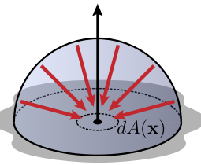

---
tags:
- CG
date: 23/09/2022
---

# Light
## Source of Light
- Incandescence [白炽 - 维基百科，自由的百科全书 (wikipedia.org)](https://zh.wikipedia.org/wiki/%E7%99%BD%E7%86%BE)
	- Blackbody radiation
- Luminescence [冷发光 - 维基百科，自由的百科全书 (wikipedia.org)](https://zh.wikipedia.org/wiki/%E5%86%B7%E5%8F%91%E5%85%89)
	- Atomic emission
	- Molecular emission (Aurora borealis)
	- Stimulated emission (LASER)
	- Fluorescence [荧光 - 维基百科，自由的百科全书 (wikipedia.org)](https://zh.wikipedia.org/wiki/%E8%8D%A7%E5%85%89) / Phosphorescence [磷光 - 维基百科，自由的百科全书 (wikipedia.org)](https://zh.wikipedia.org/wiki/%E7%A3%B7%E5%85%89)
	- Chemiluminescence [化学发光 - 维基百科，自由的百科全书 (wikipedia.org)](https://zh.wikipedia.org/wiki/%E5%8C%96%E5%AD%A6%E5%8F%91%E5%85%89) / Bioluminescence [生物发光 - 维基百科，自由的百科全书 (wikipedia.org)](https://zh.wikipedia.org/wiki/%E7%94%9F%E7%89%A9%E5%8F%91%E5%85%89)

## Quantifying Light(Radiometry)
In computer graphics, we usually consider light as group of photons, rather than waves, i.e. we don't consider interference or diffraction. Only the geometric aspect of light is considered.

Assume light consists of photons with
- position
- direction
- wave length

Basic quantities:
- flux $\Phi$
- irradiance $E$
- radiosity $B$
- intensity $I$
- radiance(most important) $L$

| Quantity                    | Explanation                                                                                                                                | Formula                                                                                                                                                                                   |
| --------------------------- | ------------------------------------------------------------------------------------------------------------------------------------------ | ----------------------------------------------------------------------------------------------------------------------------------------------------------------------------------------- |
| Flux(Radiant flux / Power)  | Total amount of radiant energy passing through surface or space per unit time 
                                    | $\Phi(A) \quad \left[ \frac{J}{s} = W \right]$                                                                                                                                            |
| Irradiance                  | Flux per unit area arriving at a surface 
                                                                         | $B(\mathbf{x}) = \frac{d\Phi(A)}{dA(\mathbf{x})} \quad \left[ \frac{W}{m^{2}} \right]$                                                                                                    |
| Radiosity(radiant exitance) | Flux per unit area leaving a surface 
                                                                             | $E(\mathbf{x}) =  \frac{d\Phi(A)}{dA(\mathbf{x})} \quad \left[ \frac{W}{m^{2}} \right]$                                                                                                   |
| Radiant density             | Directional density of flux / power(flux) per solid angle 
                                                        | $I(\mathbf{w}) =  \frac{d\Phi}{d\mathbf{w}} \quad  \left[ \frac{W}{\text{sr}} \right]$                                                                                                    |
| Radiance                    | - Intensity per perpendicular unit area   - Flux density per unit solid angle, per perpendicular unit area  
  | $$\begin{align*}L(\mathbf{x}, \mathbf{w}) &= \frac{d I}{dA^{\perp}} \\\ & = \frac{d^{2}\Phi(A)}{ \cos \theta dA(\mathbf{x}) d\mathbf{w}} \\  &= \frac{ dE }{ \cos\theta d\mathbf{w} } \end{align*}$$ |

Among all these quantities, radiance is the most important one. 
- **Fundamental quantity for ray tracing**
- Remains constant along a ray
- Incident radiance $L_{i}$ at one point can be expressed as outgoing radiance $L_{o}$ at another point (Light path inversible) 

## Supplementary: Solid Angle
Just like a planar angle in radians is the ratio of the length of an arc to its radius, a solid angle in steradians is the ratio of the area covered on a sphere by an object to the area given by the square of the radius of said sphere. The formula is

$$
\Omega = \frac{A}{r^{2}}
$$

In spherical coordinates, the formula for differential solid angle is

$$
d\Omega = \frac{dA}{r^{2}} = \sin\theta \,d\theta \,d\phi
$$

The solid angle for an arbitrary oriented surface $S$ subtended at a point $P$ is equal to the solid angle of the projection of the surface $S$ to the unit sphere with center $P$, which can be calculated as the surface integral

$$
\Omega = \iint_{S} \frac{\vec{e}_{r}\cdot \vec{n}}{r^{2}}dS = \iint_{S} \sin\theta \,d\theta \,d\phi
$$

where $\vec{e}_{r}$ is the radial unit vector and $\vec{n}$ is the surface normal.

In differential form

$$
d\Omega = \frac{dS}{r^{2}} (\vec{e}_{r}\cdot \vec{n})
$$
