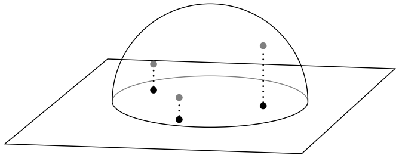

---
tags:
- CG
date: 26/01/2023
---

# Sampling
We now have the great [Monte Carlo Integration](Monte%20Carlo%20Integration.md) method. To apply it, we need a way to sample points for integration.

## Rejection Sampling

### Disk


```cpp
Vec2 v; 
do 
{ 
	v.x = 1-2*drand48(); 
	v.y = 1-2*drand48(); 
} while(v.length2() > 1)

```

### Sphere


```cpp
Vector3D v; 
do 
{ 
	v.x = 1-2*drand48(); 
	v.y = 1-2*drand48(); 
	v.z = 1-2*drand48(); 
} while(v.length2() > 1) 

// Project onto sphere 
v /= v.length();

```

### Hemisphere


```cpp
Vector3D v; 
do 
{ 
	v.x = 1-2*drand48(); 
	v.y = 1-2*drand48(); 
	v.z = 1-2*drand48(); 
} while(v.length2() > 1) 

// flip to proper hemisphere 
if (dot(v,n) < 0) v = -v; 
// Project onto hemisphere 
v /= v.length();
```

**Pros:**
- Flexible

**Cons:**
- Inefficient
- Difficult/impossible to combine with stratification or quasi-Monte Carlo


## Sampling Arbitrary Distributions
### The Inversion Method
1. Compute the CDF $P(x) = \int _{0}^{x} p(t) \, dt$.
2. Compute the inverse function $P^{-1}(x)$.
3. Obtain a uniformly distributed random number $\xi$.
4. Compute $X_{i} = P^{-1}(\xi)$.


**Example**:
Sample with pdf 

$$
\begin{align}
p(y) & = 2y, \quad y\in[0,1] \\
P(y) & = y^{2}  \\
P^{-1}(\xi) & = \sqrt{ \xi } 
\end{align}
$$

Thus when we sample from a uniform distribution from a uniform distribution $\xi \sim \text{uniform(0,1)}$, we get the corresponding sample $y_{i} = \sqrt{ \xi_{i} }$.

### Sampling 2D Distributions
Draw samples $(X,Y)$ from a 2D distribution $p(x,y)$:
- If $p(x,y)$ is separable, i.e., $p(x,y)=p_{x}(x)p_{y}(y)$, we can independently sample $p_{x}(x)$ and $p_{y}(y)$.
- Otherwise, compute the marginal density function: 


$$
p(x) = \int p(x,y) \, dy
$$

- and the conditional density:


$$
p(y|x) = \frac{p(x,y)}{p(x)}
$$


- Procedure: first sample $X_{i}\sim p(x)$, then sample $Y_{i}\sim p(y|x=X_{i})$.

### Area-preserving Sampling
Usually if we want to sample a point on a surface or in a volume, the PDF is simply $1$ divided by the surface area or the volume. If we want to keep this property that the point is sampled uniformly in the space, we can
1. Define the desired probability density of samples in a convenient coordinate system
2. Find (another) coordinate system for a convenient parameterization of the samples
3. Relate the PDFs in the two systems
	- Requires computing the determinant of the Jacobian
4. Compute marginal and conditional 1D PDFs
5. Sample 1D PDFs using the inversion method

**Uniform(Area-Preserving) Sampling of a Disk**
- pdf for uniform sampling on a disk in cartesian system


$$
p_c(x, y)= \begin{cases}\frac{1}{\pi} & x^2+y^2<1 \\ 0 & \text { otherwise }\end{cases}
$$


- Sample in polar coordinates $r, \theta$ where:


$$
x = r\cos\theta, \quad y = r\sin\theta
$$


- Relate the PDFs

$$
p_{p}(r,\theta) = |J|p_{c}(x,y) = \frac{r}{\pi}
$$

- Compute marginal and conditional 1D PDFs:
	- Marginal PDF:

$$
p(r) = \int _{0}^{2\pi} p_{p}(r,\theta) \, d\theta = 2r
$$

	- Conditional PDF:

$$
p(\theta|r) = \frac{p_{p}(r,\theta)}{p(r)} = \frac{1}{2\pi}
$$


- Using inversion method we have


$$
r = \sqrt{ \xi_{1} }, \quad \theta = 2\pi \xi_{2}
$$

**Uniform(Area Preserving) Sampling a Unit Sphere/ Hemisphere/ Sphere Cap**
Archimedes’ hat box theorem

Enclose a sphere in a cylinder and cut out a spherical segment by slicing twice perpendicularly to the cylinder’s axis. Then the lateral surface area of the spherical segment $S_{1}$ is equal to the lateral surface area cut out of the cylinder $S_{2}$ by the same slicing planes, i.e.,

$$
S_{1} = S_{2} = 2\pi Rh
$$

Using this property, we could sample a point on the cylinder and find a bijective mapping between cylinder and sphere, then map the point on the cylinder to the sphere. This could be easily done by using the same $z$ coordinate.

The probability in cylindrical coordinates when sampling a cylinder is 

$$
p(\phi,z) = \frac{1}{2\pi} \cdot \frac{1}{z_{2}-z_{1}}
$$

and we could easily transform a square to this

$$
\begin{align}
\phi & = 2\pi \xi_{1} \\
z & = (z_{2}-z_{1})\xi_{2}
\end{align}
$$

The corresponding spherical coordinates is 

$$
\begin{align}
\theta  & = \arccos z \\
\phi & = \phi
\end{align}
$$

To sample on hemisphere and sphere cap, simply change the range of $z$ to match the height.

**Cosine-weighted Hemispherical Sampling**
Generating points uniformly on the disc, and then project these points to the surface of the hemisphere produces the desired distribution.
The probability under spherical coordinates is 

$$
p(\theta, \phi) = 
\begin{cases}
\frac{\cos\theta}{\pi},  & \quad \text{on hemisphere} \\
0,  & \quad \text{else}
\end{cases}
$$

If you compare the form with sampling on a disk, we could easily conclude that it’s the same distribution.


**Beckmann Distribution**
The cosine weighted Beckmann distribution is 

$$
p(\theta,\phi) = D(\theta) \cos\theta  = \frac{e^{ -\tan ^{2} \theta/\alpha^{2} }}{\pi \alpha^{2}\cos ^{4}\theta} \cos\theta
$$

The CDF is 

$$
\begin{align}
P(\Theta, \Phi) & = \int _{0}^{\Theta}\int _{0}^{\Phi} p(\theta,\phi) \sin\theta \, d\theta  \, d\phi  \\
  & = \int _{0}^{\Theta}\int _{0}^{\Phi} \frac{e^{ -\tan ^{2} \theta/\alpha^{2} }}{\pi \alpha^{2}\cos ^{3}} \sin\theta \, d\theta  \, d\phi  \\
  & = \frac{\Phi}{2\pi} \int _{0}^{\Theta} e^{ -\tan ^{2}\theta/\alpha^{2} } \, d\left( \frac{\tan ^{2}\theta}{\alpha^{2}}  \right) \\
  & = \frac{\Phi}{2\pi}[1 - e^{ -\tan ^{2}\Theta / \alpha^{2} }] = F_{1}(\Phi) F_{2}(\Theta)
\end{align}
$$

where

$$
\begin{align}
F_{1}(\Phi) & = \frac{\Phi}{2\pi} \\
F_{2}(\Theta) & = 1 - e^{ -\tan ^{2}\Theta / \alpha^{2} }
\end{align}
$$

which means we can sample $\phi, \theta$ independently. Inverse the function we have

$$
\begin{align}
\phi & = 2\pi \xi_{1} \\
\theta & = \arctan \sqrt{ -\alpha^{2}\ln(1-\xi_{2}) }
\end{align}
$$

**Useful Transformations**
