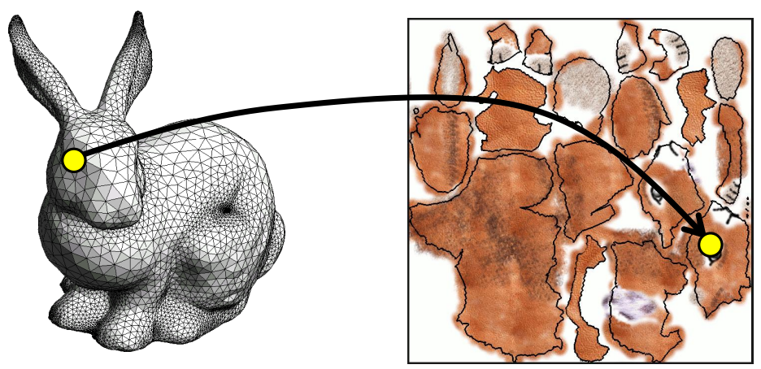

---
tags:
- CG
date: 30/09/2022
---

# Texture Mapping
Texture mapping aims to:
- map images on surface
- assign color/material property to every point on the surface
- map between surface and texture space

Each point $(x,y,z)$ on the surface has mapped coordinates $(u,v)$ in the texture image:

$$
\begin{align}
P: \mathbb{R}^{3} \to \mathbb{R}^{2} \\
P(x,y,z)  = (u,v)
\end{align}
$$

Texture itself is a function

$$
\begin{align}
T: \mathbb{R}^{2} \to \text{RGB} \\
T(u,v) = (r,g,b)
\end{align}
$$

Concatenation of the two functions gives the color function

$$
\text{Color}(x,y,z) = T(P(x,y,z))
$$

## Parametrization
Please refer to [Parameterization](/Parameterization.md)